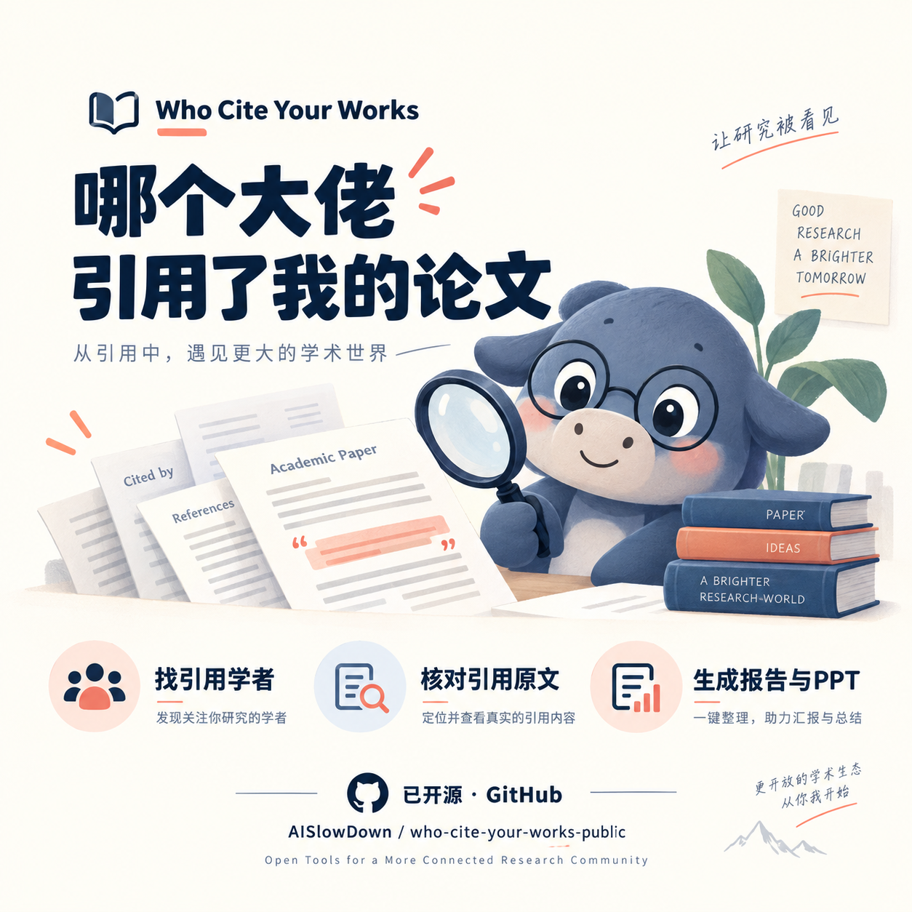

# 哪个大佬引用了我的论文

**Who Cite Your Works** · 一个基于证据的 Codex 学术引用检索 skill。

按需筛选引用学者与机构，核对引用原文，整理作者索引、本人论文索引和中文引用影响力报告；还可由用户选择专家，制作可编辑的同行引用 PPT。

- 可配置第一/通讯作者或全部作者、被引次数门槛、985/211/双一流及 QS 前 200 等机构范围。
- 保留引用原文及中文解释，区分背景引用、方法采用与明确评价，不将普通引用当作赞誉。
- PPT 提供候选专家与对应被引论文，支持单页双栏对齐和空白评价行。详见 [PPT 输出规则](references/ppt-peer-evaluation.md)。

仍在改进中，来源覆盖及全文访问可能受限，结果需要核验。宣传图为 AI 生成插画，不含真实研究者资料。

An evidence-grounded Codex skill for monitoring citations to a researcher's papers, identifying influential citing authors and institutions, and explaining citation context when source evidence is available.

Status: initial skill entrypoint and versioned institution-priority cache implemented; citation acquisition code remains under development.

The [targeted citation-context collector](references/citation-retrieval.md) now supports a default goal of 10 distinct authors with verified evidence, ranked backfilling, linked HTML/XML and numbered PDF extraction, paginated Semantic Scholar fallback, and checkpoint/cache preservation. Candidate excerpts and verified reference matches remain separate; source coverage and Chinese interpretation still require review.

## Planned capabilities

- Before each new search, confirm whether to include only first/corresponding authors or every citing-paper author, and whether to restrict results to mainland 985/211/Double First Class plus QS top-200 institutions or include all institutions.
- Merge a confirmed local publication list with manually reviewed Google Scholar candidates.
- Retrieve citing works through OpenAlex and Semantic Scholar.
- Apply the user-confirmed author-role and institution scope while retaining the evidence needed to change the display filter later.
- Rank deduplicated qualifying authors by total citations and verify the top 100. Keep detailed title and talent fields in the evidence cache, while presenting a compact author, institution, title, combined honors, status, and source view for reading.
- Flag verified expert-watchlist matches, mainland 985/211/second-round Double First Class institutions, and the configured QS top 200.
- Preserve short citation-context evidence and explain in Chinese why a paper cited the tracked work.
- Export one Excel workbook with two default views: a citing-author index (one disambiguated author per row) and an own-paper index (one tracked publication per row), pairing citing scholars with their paper affiliations and citing works. Retain unmatched publications, distinguish incomplete searches from no qualifying matches, and preserve detailed evidence in Markdown/JSON. See [the output contract](references/report-indexes.md).
- Support manual checks and optional weekly monitoring without treating source failures as zero citations.

See [the approved design](docs/specs/2026-08-31-who-cite-your-works-design.md).

The runtime institution cache is generated from the versioned snapshot by
`scripts/build-institution-priority-cache.mjs`. Existing cached institutions are
reused without repeating web lookups; only previously unseen institutions need
targeted verification.
